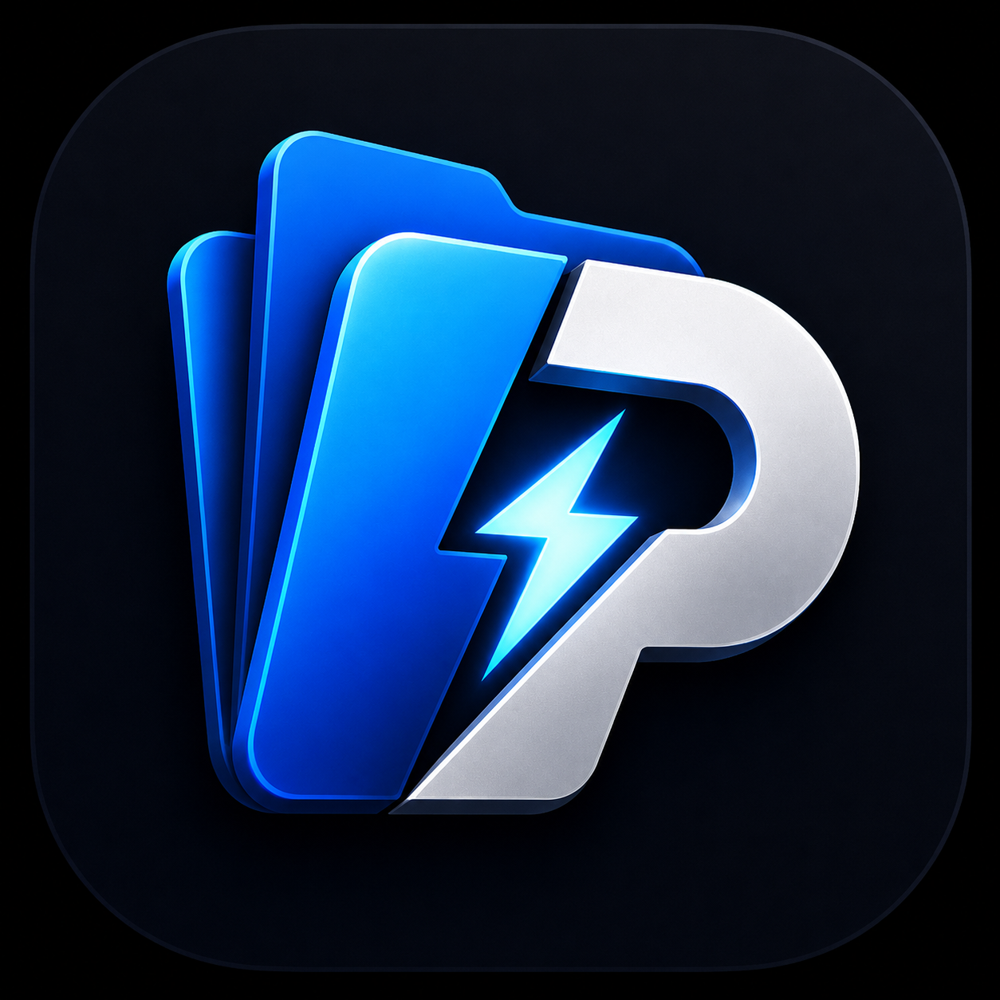

# PowerDesk

A modern file manager for Windows built with Electron, React, and TypeScript.

PowerDesk replaces Windows Explorer with a tabbed, keyboard-first interface featuring dual-pane browsing, smart search, built-in tools, and a fully customizable UI.

> **Current status:** Early release (v0.1.0). Core features are working. Expect rough edges.


<p align="center">
  
</p>

---

## Features

- **Tabbed browsing** — unlimited tabs with drag reorder, pin, split
- **Dual-pane mode** — side-by-side file browsing
- **3 view modes** — Grid, List, Gallery with adjustable icon sizes
- **Smart search** — natural language filters, saved searches, command palette
- **Transfer Center** — copy/move with speed, ETA, pause/resume/cancel
- **Universal undo/redo** — every operation reversible
- **File preview** — images, video, audio, PDF, Markdown, code with syntax highlighting
- **File Inspector** — EXIF metadata, camera info, dominant color
- **Folder Analysis** — storage breakdown, duplicate detection, largest files
- **Clipboard Manager** — history, favorites, search
- **Built-in tools** — QR generator, terminal, color picker
- **Tags & color labels** — organize files with custom tags
- **Workspace profiles** — save and load entire layouts
- **8 color themes** — plus full UI customization (colors, fonts, opacity, blur)
- **Plugin system** — extensible with 15+ extension points

---

## Screenshots

> Coming soon.

---

## Installation

### Portable

Download `PowerDesk_Portable.zip`, extract, and run `PowerDesk.exe`.

### Installer

Run `PowerDeskSetup.exe` to install with Start Menu and Desktop shortcuts.

### Build from source

```bash
git clone https://github.com/PowerDeskApp/PowerDesk.git
cd PowerDesk
npm install
npm run electron:dev
```

**Requirements:** Node.js 18+, npm, Windows 10/11

---

## Keyboard Shortcuts

| Shortcut | Action |
|----------|--------|
| `Ctrl+T` / `Ctrl+W` | New / Close Tab |
| `Ctrl+Tab` / `Ctrl+Shift+Tab` | Next / Previous Tab |
| `Ctrl+P` | Search |
| `Ctrl+Shift+P` | Command Palette |
| `Ctrl+B` | Toggle Sidebar |
| `Ctrl+Shift+\` | Dual Pane |
| `Ctrl+Z` / `Ctrl+Y` | Undo / Redo |
| `Ctrl+Shift+V` | Clipboard Manager |
| `Ctrl+Shift+W` | Workspace Profiles |
| `Ctrl+N` | New Window |
| `Space` | Quick Preview |
| `F2` | Rename |
| `Backspace` | Go Up |
| `Arrow Keys` | Navigate Files |

---

## Tech Stack

Electron 33, React 18, Zustand 5, TypeScript 5, Vite 6, Lucide React, Sharp, Archiver

---

## Project Goals

- Replace Windows Explorer with something faster and more productive
- Keyboard-first design for power users
- Fully customizable appearance
- Extensible through plugins
- Stay lightweight and maintainable by one person

---

## FAQ

**Is this free?** Yes, MIT licensed.

**Does it work on macOS/Linux?** Not yet. Windows is the primary target.

**Can I contribute?** See [CONTRIBUTING.md](CONTRIBUTING.md).

---

## About

PowerDesk was built using extensive AI-assisted development (Ai agents) under my direction. I designed the features, made the architectural decisions, and tested everything — but the code was largely generated with AI assistance. I believe in being honest about how modern software gets made (Yes the .md files were written with ai too and edited by me).

---

## License

[MIT](LICENSE)
