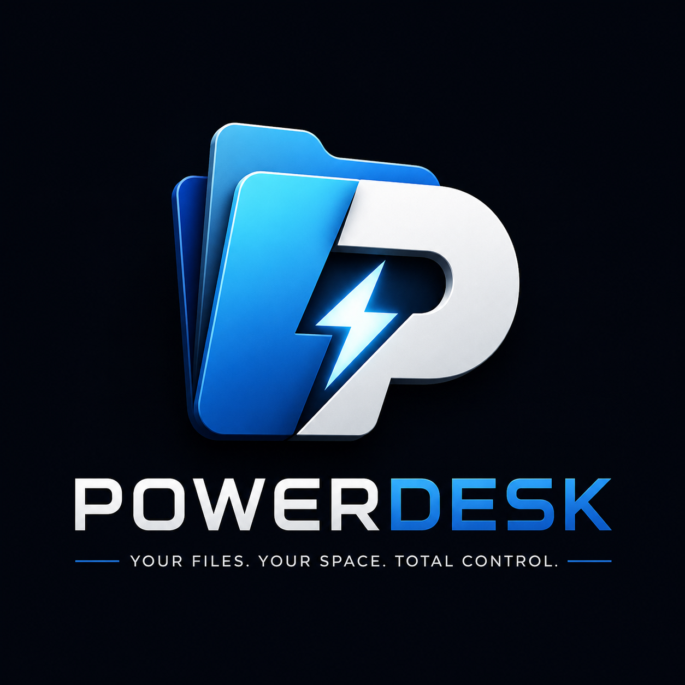
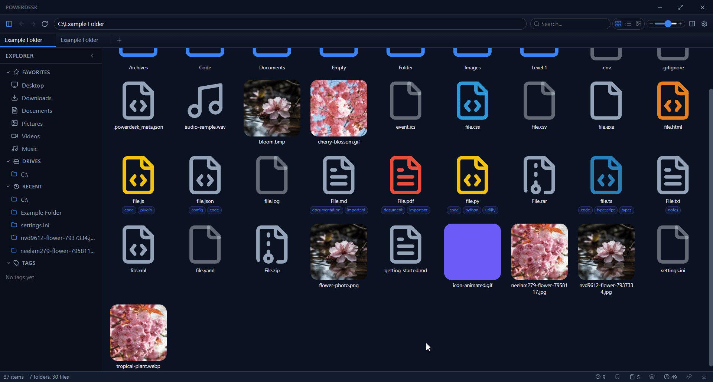
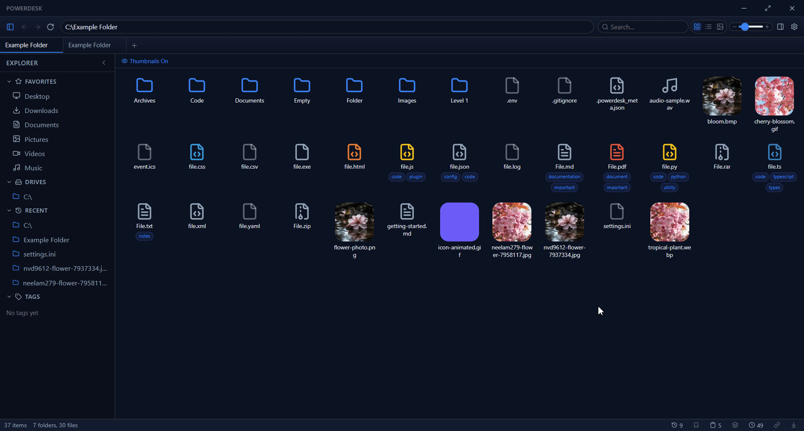
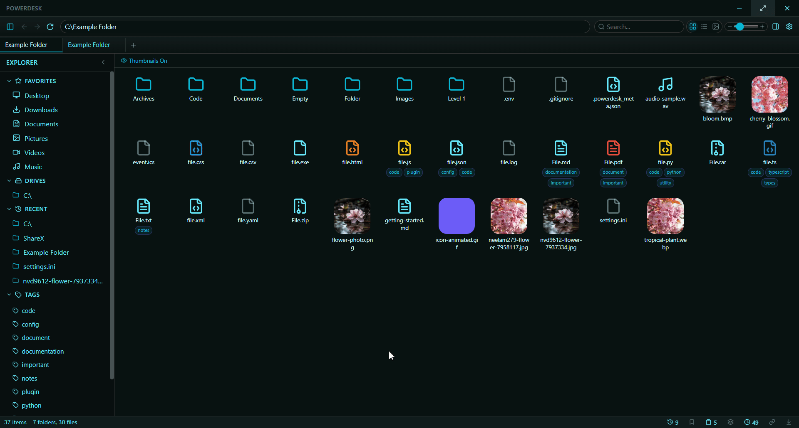
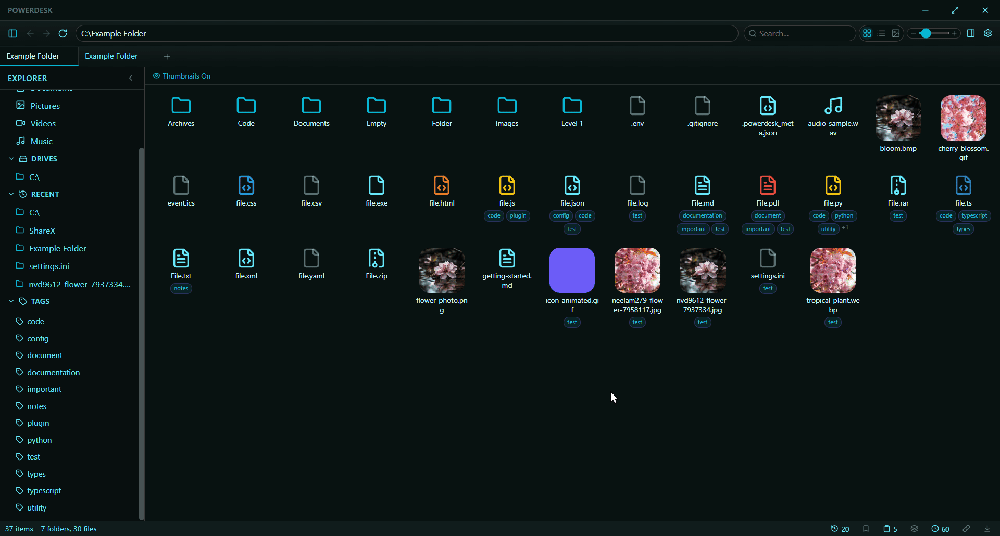

# PowerDesk
<p align="center">


<p>
> The operating system you wish Windows came with.

Not just a file explorer. A workspace. An automation hub. A desktop replacement.

<p align="center">
  
</p>

<p align="center">
  
</p>

---

## What is PowerDesk?

PowerDesk is a modern, keyboard-first file manager for Windows built with Electron, React, and TypeScript. It replaces Windows Explorer with a VSCode-inspired interface featuring tabs, dual-pane browsing, a powerful search engine, built-in tools, and a fully customizable UI.

---

## Features at a Glance

- **Tabbed browsing** — unlimited tabs with drag reorder, pin, duplicate, and split
- **Dual-pane mode** — side-by-side file browsing like Total Commander
- **Custom title bar** — frameless window with drag-to-snap (top=maximize, sides=half)
- **3 view modes** — Grid (with adjustable icon size), List (with sortable columns), Gallery (image-focused)
- **Smart search** — natural language queries, 30+ filter types, saved searches
- **Transfer Center** — custom copy/move with speed, ETA, pause/resume/cancel/retry
- **Universal undo/redo** — every operation reversible, persisted across sessions
- **File preview** — images, video, audio, PDF, Markdown, code (35+ languages), JSON, CSV
- **File Inspector** — EXIF metadata, camera info, dominant color, DPI, dimensions
- **Folder Analysis** — storage breakdown, pie charts, duplicate detection, largest files
- **Clipboard Manager** — history, favorites, search, code detection
- **Batch Rename** — pattern-based with live preview
- **Built-in tools** — QR generator, terminal, color picker with WCAG contrast checker
- **8 color themes** — Midnight Purple, Ocean Blue, Forest Green, Sunset Orange, Rose Pink, Neon Cyan, Warm Light, Pure White
- **Full UI customization** — colors, font size, corner radius, opacity, blur, borders
- **Workspace profiles** — save/load entire layouts (tabs, theme, settings)
- **Multi-window sync** — synchronize navigation across windows
- **Favorite bar** — browser-style bookmarks for files and folders
- **Tags & color labels** — organize files with custom tags and 7 color options

---

## Showcase

### Dual Pane Browsing
Side-by-side file management for effortless copy, move, and comparison.

<p align="center">
  
</p>

### Tags & Color Labels
Organize files with custom tags and color labels. Filter instantly from the sidebar.

<p align="center">
  
</p>

### Folder Analysis
Storage breakdown, pie charts, duplicate detection, and largest files at a glance.

<p align="center">
  
</p>

### Customization
Full control over themes, colors, fonts, corner radius, opacity, and more.

<p align="center">
  
</p>

---

## Search Performance

PowerDesk uses a custom Go binary indexer that scans your entire filesystem in parallel. Compared to Windows' native search APIs:

| Benchmark | PowerDesk (Go Indexer) | PowerShell `Get-ChildItem` | Speedup |
|-----------|----------------------|---------------------------|---------|
| User Profile (~110K files) | **3.0s** | 21.8s | **7.2x faster** |
| Full C: Drive (~424K files) | **13.9s** | 81.4s | **5.9x faster** |

> Tested on: Windows 10, Intel Core i7, 8GB RAM, 256GB SSD
>
> The indexer runs in the background and builds a searchable index. Queries against the index are near-instant regardless of filesystem size.

---

## Getting Started

### Prerequisites

- Node.js 18+
- npm or yarn
- Windows 10/11 (primary target)

### Installation

```bash
git clone https://github.com/Faycal-KJ/PowerDesk.git
cd PowerDesk
npm install
```

### Development

```bash
npm run electron:dev
```

This starts Vite dev server and Electron simultaneously with hot reload.

### Build

```bash
npm run electron:build
```

---

## Keyboard-First Design

PowerDesk is designed for keyboard power users. Every major action has a shortcut:

| Shortcut | Action |
|----------|--------|
| Ctrl+T / Ctrl+W | New / Close Tab |
| Ctrl+Tab / Ctrl+Shift+Tab | Next / Previous Tab |
| Ctrl+P | Search |
| Ctrl+Shift+P | Command Palette |
| Ctrl+B | Toggle Sidebar |
| Ctrl+Shift+\\ | Dual Pane |
| Ctrl+Z / Ctrl+Y | Undo / Redo |
| Ctrl+Shift+V | Clipboard Manager |
| Ctrl+Shift+H | Command History |
| Ctrl+Shift+W | Workspace Profiles |
| Ctrl+N | New Window |
| Space | Quick Preview |
| F2 | Rename |
| Backspace | Go Up |
| Arrow Keys | Navigate Files |

See [FEATURES.md](FEATURES.md) for the complete shortcuts reference.

---

## Built-in Tools

### QR Generator
Type any text or URL, see a live QR code, download as PNG.

### Terminal
Embedded PowerShell terminal running in the current directory. Dark theme matching VS Code.

### Color Tool
Full HSV color picker with HEX/RGB/HSL/HSV/CSS/Integer formats, alpha slider, color harmonies (complementary, analogous, triadic, split complementary, tetradic), WCAG contrast checker with AA/AAA grading, favorites, history, and 24 presets.

---

## Tech Stack

| Technology | Purpose |
|-----------|---------|
| Electron 33 | Desktop shell, frameless window, IPC |
| React 18 | UI framework |
| Zustand 5 | State management |
| TypeScript 5 | Type safety |
| Vite 6 | Build tool |
| Lucide React | Icons |
| Sharp | Image thumbnails & EXIF |
| Archiver | ZIP compression |
| qrcode | QR generation |
| Go | Fast file indexer |

---

## Project Structure

```
powerdesk/
├── electron/
│   ├── main.js          # Electron main process (IPC, window, transfers)
│   └── preload.js       # Context bridge for renderer
├── go-indexer/
│   └── main.go          # Fast file indexer binary
├── bin/
│   └── pdx-index.exe    # Compiled Go indexer
├── src/
│   ├── components/      # React components (26 files)
│   ├── stores/
│   │   └── useStore.ts  # Central Zustand store
│   ├── lib/
│   │   └── searchParser.ts  # Smart search query parser
│   ├── types/
│   │   └── index.ts     # TypeScript type definitions
│   ├── styles/
│   │   └── global.css   # CSS variables and global styles
│   ├── App.tsx          # Root component
│   └── main.tsx         # Entry point
├── FEATURES.md          # Complete feature documentation
├── package.json
├── tsconfig.json
└── vite.config.ts
```

---

## License

MIT

---

*PowerDesk v0.1.0*
